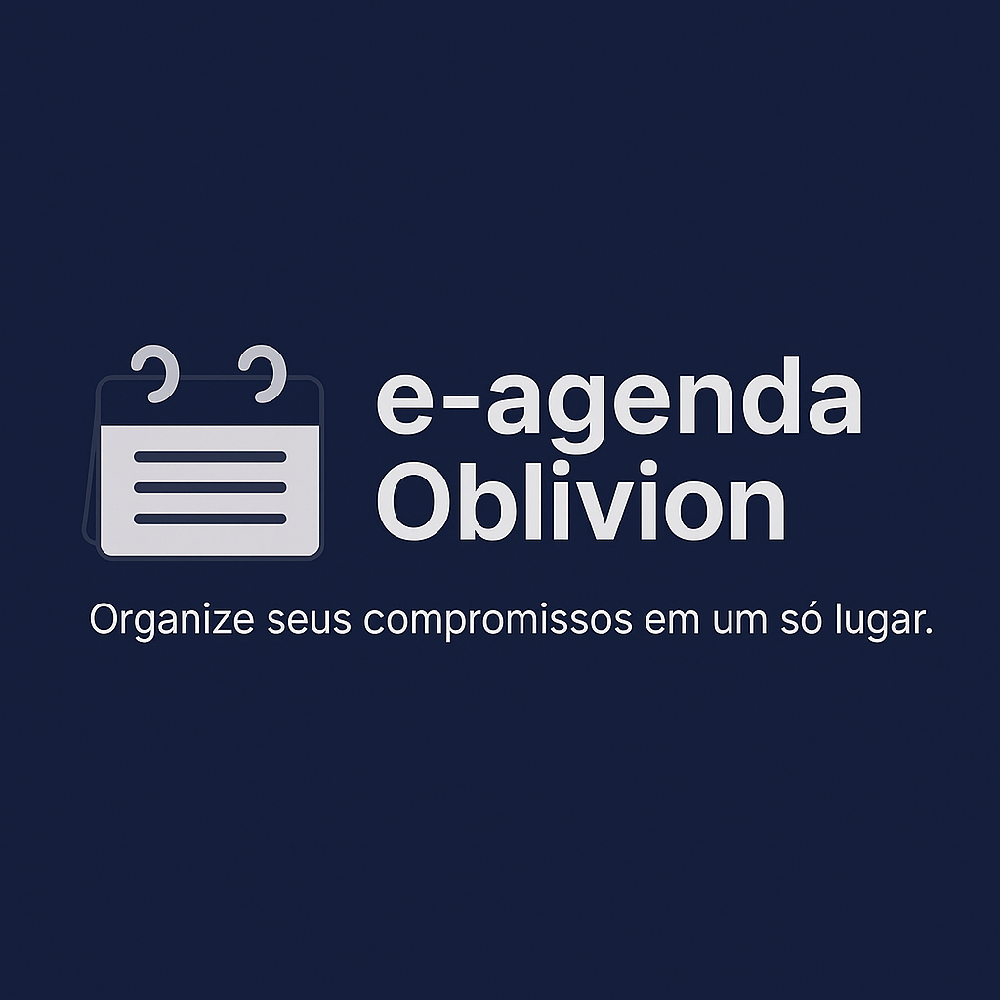

# E-Agenda




# 📌 Demonstração
## Navegações

## Cadastro de Compromisso

## Cadastros de Tarefa


# 💡 Índice

- [Demonstração](#-demonstração)
- [Introdução](#-introdução)
- [Funcionalidades](#-funcionalidades)
- [Estrutura do Projeto](#-estrutura-do-projeto)
- [Tecnologias Usadas](#-tecnologias-usadas)
- [Commits e Convenções](#-commits-e-convenções)
- [Como rodar o projeto](#-como-rodar-o-projeto)
- [Contribuidores](#-contribuidores)
- [Mentores](#-mentores)
- [Sobre o Projeto](#-sobre-o-projeto)
- [Feedback](#-feedback)
- [Como Contribuir](#-como-contribuir)


# 📚 Introdução

O **E-Agenda** é uma aplicação web desenvolvida em ASP.NET Core MVC, projetada para gerenciar contatos, compromissos, categorias, despesas e tarefas de forma integrada e eficiente. O objetivo é fornecer uma experiência centralizada para o usuário organizar sua rotina e atividades do dia a dia, com regras de negócio sólidas e interface intuitiva.

# ✨ Funcionalidades

- 🗂️ **Gestão Completa de Registros** – Cadastro, edição, exclusão e listagem de contatos, compromissos, categorias, despesas e tarefas.
- 👀 **Visualização Avançada** – Listagens filtradas por status, prioridade, categoria e outros critérios relevantes.
- ✅ **Validações Inteligentes** – Campos obrigatórios, formatos de dados e regras de negócio aplicadas automaticamente.
- 🔗 **Relacionamentos Entre Módulos** – Vinculação entre contatos e compromissos, despesas e categorias, tarefas e itens.
- 🚫 **Prevenção de Conflitos** – Impede duplicidade, exclusão indevida e conflitos de horários nos compromissos.
- 💾 **Persistência Local** – Todos os dados armazenados de forma local e persistente.
- 💡 **Interface Intuitiva** – Navegação fluida e responsiva, facilitando o uso em diferentes dispositivos.

## 🧱 Estrutura do Projeto

```text
E-Agenda
│
├── 🧠 E-Agenda.Dominio         # Entidades de negócio e regras de domínio
│   └── ModuloCategorias, ModuloCompromissos, ModuloContatos, ModuloDespesas, ModuloTarefa, Compartilhado
│
├── 💾 E-Agenda.Infraestrutura  # Persistência, repositórios e acesso a dados
│   └── (Mesmos módulos e base compartilhada)
│
└── 🌐 E-Agenda.WebApp    # Camada de apresentação (ASP.NET MVC)
    ├── Controllers      # Lógica de controle e roteamento
    ├── Views            # Páginas e telas para o usuário (Razor)
    ├── Models           # Modelos de dados usados na interface
    ├── Extensions       # Extensões e utilitários
    └── wwwroot          # Arquivos estáticos (imagens, CSS, JS)
```

- 🧠 **Dominio:** Aqui ficam as entidades principais do sistema, cada uma representando um módulo (Contatos, Compromissos, Categorias, Despesas, Tarefas), além de regras de negócio e contratos que garantem a integridade dos dados.

- 💾 **Infraestrutura:** Responsável pela persistência dos dados, com repositórios e serviços que salvam, leem e atualizam as informações, normalmente em arquivos locais.

- 🌐 **WebApp:** Camada de apresentação do sistema, construída com ASP.NET MVC. Nela estão os controllers (lógica de navegação), views (interface), e models específicos da UI, além dos recursos estáticos.


# 🔧 Tecnologias usadas

[](https://skillicons.dev)

# 🧠 Commits e Convenções

Utilizamos [Conventional Commits](https://www.conventionalcommits.org/pt-br/v1.0.0/) para padronizar as mensagens de commit.

# ▶️ Como rodar o projeto

1. Clone o repositório:  
   `git clone https://github.com/SeuUsuario/E-Agenda.git`
2. Abra a solução no Visual Studio 2022.
3. Execute o projeto `E-Agenda.WebApp` (F5).

# 👥 Contribuidores

<p align="left">
  <a href="https://github.com/AgathaSates">
    
  </a>
  &nbsp;&nbsp;&nbsp;
  <a href="https://github.com/otaviobrignoni">
    
  </a>
    &nbsp;&nbsp;&nbsp;
  <a href="https://github.com/AlexAraldi">
    
  </a>
</p>

| Nome | GitHub |
|------|--------|
| Agatha Sates | [@AgathaSates](https://github.com/AgathaSates) |
| Otavio Brignoni | [@Otavio Brignoni](https://github.com/otaviobrignoni) |
| Alexander Araldi | [@Alexander Araldi](https://github.com/AlexAraldi) |

# 👨‍🏫 Mentores

<p align="left" style="margin-left: 27px;">
  <a href="https://github.com/tiagosantini">
    
  </a>
  &nbsp;&nbsp;&nbsp;
  <a href="https://github.com/alexandre-rech-lages">
    
  </a>
</p>


| Nome | GitHub |
|------|--------|
| Tiago Santini | [@Tiago Santini](https://github.com/tiagosantini) |
| Alexandre Rech | [@Alexandre Rech](https://github.com/alexandre-rech-lages) |

# 🏫 Sobre o Projeto

Desenvolvido durante o curso Fullstack da [Academia do Programador](https://academiadoprogramador.net) 2025

# 💬 Feedback

Se você tiver sugestões de melhoria, novas ideias ou quiser nos avisar sobre um bug, abra uma [Issue](https://github.com/Code-Oblivion/E-Agenda/issues) ou entre em contato!

# 🤝 Como Contribuir

1. 🍴 Faça um fork
2. 🛠️ Crie uma branch `feature/sua-feature`
3. 🔃 Commit com mensagens semânticas (`feat: nova tela`)
4. 📥 Abra um Pull Request e aguarde o review